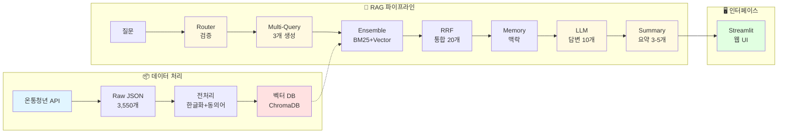

# 시스템 아키텍처

```mermaid
graph LR
    subgraph Data["📦 데이터 처리"]
        A[온통청년 API] --> B[Raw JSON<br/>3,550개]
        B --> C[전처리<br/>한글화+동의어]
        C --> D[벡터 DB<br/>ChromaDB]
    end
    
    subgraph RAG["🤖 RAG 파이프라인"]
        E[질문] --> F[Router<br/>검증]
        F --> G[Multi-Query<br/>3개 생성]
        G --> H[Ensemble<br/>BM25+Vector]
        D -.-> H
        H --> I[RRF<br/>통합 20개]
        I --> J[Memory<br/>맥락]
        J --> K[LLM<br/>답변 10개]
        K --> L[Summary<br/>요약 3-5개]
    end
    
    subgraph UI["🖥️ 인터페이스"]
        L --> M[Streamlit<br/>웹 UI]
    end
    
    style A fill:#e1f5ff
    style D fill:#ffe1e1
    style F fill:#fff9e1
    style G fill:#fff9e1
    style K fill:#fff9e1
    style L fill:#fff9e1
    style M fill:#e1ffe1
```

**LLM 호출: 총 4회**
- Router: 질문 검증
- Multi-Query: 쿼리 생성
- Answer: 답변 생성
- Summary: 요약 생성

**검색 가중치**
- BM25 (키워드): 40%
- Vector (의미): 60%