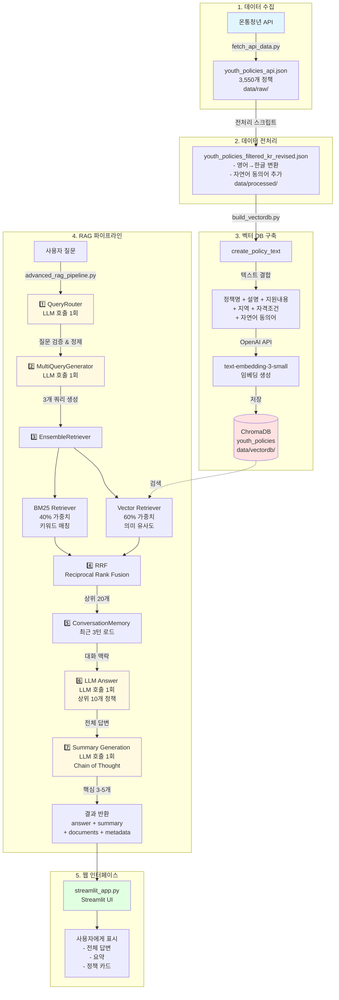

# 시스템 아키텍처

```mermaid
graph TB
    subgraph "1. 데이터 수집"
        A[온통청년 API] -->|fetch_api_data.py| B[youth_policies_api.json<br/>3,550개 정책<br/>data/raw/]
    end
    
    subgraph "2. 데이터 전처리"
        B -->|전처리 스크립트| C[youth_policies_filtered_kr_revised.json<br/>- 영어→한글 변환<br/>- 자연어 동의어 추가<br/>data/processed/]
    end
    
    subgraph "3. 벡터 DB 구축"
        C -->|build_vectordb.py| D[create_policy_text]
        D -->|텍스트 결합| E[정책명 + 설명 + 지원내용<br/>+ 지역 + 자격조건<br/>+ 자연어 동의어]
        E -->|OpenAI API| F[text-embedding-3-small<br/>임베딩 생성]
        F -->|저장| G[(ChromaDB<br/>youth_policies<br/>data/vectordb/)]
    end
    
    subgraph "4. RAG 파이프라인"
        H[사용자 질문] -->|advanced_rag_pipeline.py| I[1️⃣ QueryRouter<br/>LLM 호출 1회]
        I -->|질문 검증 & 정제| J[2️⃣ MultiQueryGenerator<br/>LLM 호출 1회]
        J -->|3개 쿼리 생성| K[3️⃣ EnsembleRetriever]
        
        K --> L[BM25 Retriever<br/>40% 가중치<br/>키워드 매칭]
        K --> M[Vector Retriever<br/>60% 가중치<br/>의미 유사도]
        
        L --> N[4️⃣ RRF<br/>Reciprocal Rank Fusion]
        M --> N
        G -.->|검색| M
        
        N -->|상위 20개| O[5️⃣ ConversationMemory<br/>최근 3턴 로드]
        O -->|대화 맥락| P[6️⃣ LLM Answer<br/>LLM 호출 1회<br/>상위 10개 정책]
        P -->|전체 답변| Q[7️⃣ Summary Generation<br/>LLM 호출 1회<br/>Chain of Thought]
        Q -->|핵심 3-5개| R[결과 반환<br/>answer + summary<br/>+ documents + metadata]
    end
    
    subgraph "5. 웹 인터페이스"
        R --> S[streamlit_app.py<br/>Streamlit UI]
        S --> T[사용자에게 표시<br/>- 전체 답변<br/>- 요약<br/>- 정책 카드]
    end
    
    style A fill:#e1f5ff
    style G fill:#ffe1e1
    style I fill:#fff9e1
    style J fill:#fff9e1
    style P fill:#fff9e1
    style Q fill:#fff9e1
    style S fill:#e1ffe1
```