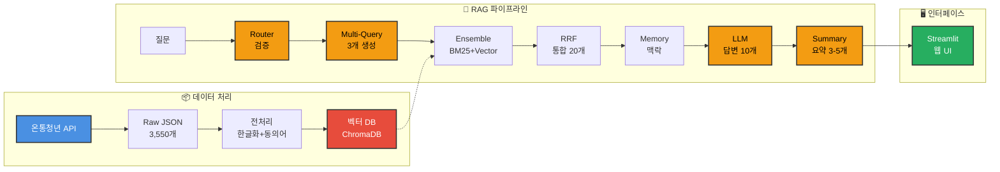

# 시스템 아키텍처

```mermaid
graph LR
    subgraph Data["📦 데이터 처리"]
        A[온통청년 API] --> B[Raw JSON<br/>3,550개]
        B --> C[전처리<br/>한글화+동의어]
        C --> D[벡터 DB<br/>ChromaDB]
    end
    
    subgraph RAG["🤖 RAG 파이프라인"]
        E[질문] --> F[Router<br/>검증]
        F --> G[Multi-Query<br/>3개 생성]
        G --> H[Ensemble<br/>BM25+Vector]
        D -.-> H
        H --> I[RRF<br/>통합 20개]
        I --> J[Memory<br/>맥락]
        J --> K[LLM<br/>답변 10개]
        K --> L[Summary<br/>요약 3-5개]
    end
    
    subgraph UI["🖥️ 인터페이스"]
        L --> M[Streamlit<br/>웹 UI]
    end
    
    style A fill:#4A90E2,stroke:#333,stroke-width:2px,color:#fff
    style D fill:#E74C3C,stroke:#333,stroke-width:2px,color:#fff
    style F fill:#F39C12,stroke:#333,stroke-width:2px,color:#000
    style G fill:#F39C12,stroke:#333,stroke-width:2px,color:#000
    style K fill:#F39C12,stroke:#333,stroke-width:2px,color:#000
    style L fill:#F39C12,stroke:#333,stroke-width:2px,color:#000
    style M fill:#27AE60,stroke:#333,stroke-width:2px,color:#fff
```