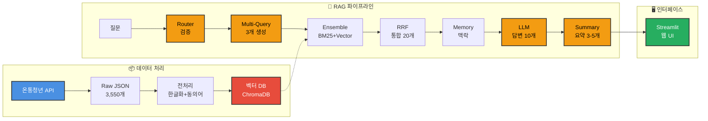

# 청년·1인 가구 생활복지·지원 챗봇 🤖
"수천 개의 정책 중 나에게 딱 맞는 혜택, AI가 3초 만에 찾아드립니다!"

🏆 [SKN Family AI캠프] 3차 단위 프로젝트 📅 개발 기간: 2025.XX.XX ~ 2025.12.11

# 개발 팀

## 팀명

## 팀원 소개

| 나호성 | 강민지 | 이지은 | 조준상 | 홍혜원 |
|---|---|---|---|---|
|  |  |  |  |  |
| (역할) | (역할) | (역할) | (역할) | (역할) |

## 1. 💡 기획 배경 및 문제 정의 (Why?)
**"청년 정책 수혜율 11%, 몰라서 못 받는 혜택을 찾아드립니다."**

중앙부처와 지자체에서 운영되는 청년 정책은 **3,000**여 개가 넘지만,
실제 청년들의 정책 수혜율은 약 **11%**에 불과합니다. (출처: 2023 청년정책 실태조사)

저희는 이 격차의 원인을 **구조적 정보 불균형**에서 찾았습니다.

### 문제의 원인

- **정보의 파편화** : 정책이 사이트별로 분산되어 탐색 비용이 큽니다.
- **비공식 경로 의존** : 청년 10명 중 5명(47%)가 지인·SNS 등에서 정보를 얻어 **정확성 저하 위험**이 존재합니다
- **복잡한 공고문** : 긴 문서와 행정 용어로 이해 난이도가 높습니다.

### 필요성
사용자 조건(나이·지역·소득 등)에 따라 정책을 **선별·요약·추천**해
탐색 부담을 줄이고 수혜 기회를 넓히는 도구가 필요합니다.

👉 Solution
정책 정보를 통합하고 사용자 조건(나이, 지역, 소득)기반으로
**맞춤형 정책을 선별·추천해주는 RAG 기반 청년·1인 가구 생활복지/지원 챗봇**을 개발했습니다

### 기대효과
- **탐색 비용 절감** : 분산된 정책 정보를 한 곳에서 조회·비교
- **맞춤 매칭 정확도 향상** : 조건 기반으로 '수혜 가능 정책' 중심 추천
- **공고문 이해 부담 완화** : 공고문 핵심 요약으로 정보 피로도 감소

# 시스템 아키텍처

**LLM 호출: 총 4회**
- Router: 질문 검증
- Multi-Query: 쿼리 생성
- Answer: 답변 생성
- Summary: 요약 생성

**검색 가중치**
- BM25 (키워드): 40%
- Vector (의미): 60%