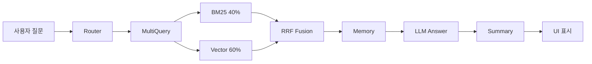

# 📦 개발된 소프트웨어: RAG 기반 LLM과 벡터 데이터베이스 연동 구현 코드

## 목차
1. [소프트웨어 개요](#1-소프트웨어-개요)
2. [시스템 아키텍처](#2-시스템-아키텍처)
3. [핵심 구현 모듈](#3-핵심-구현-모듈)
4. [RAG 파이프라인 구현](#4-rag-파이프라인-구현)
5. [벡터 데이터베이스 연동](#5-벡터-데이터베이스-연동)
6. [웹 인터페이스 구현](#6-웹-인터페이스-구현)
7. [주요 기능 코드](#7-주요-기능-코드)
8. [API 및 외부 연동](#8-api-및-외부-연동)

---

## 1. 소프트웨어 개요

### 1.1 프로젝트명
**청년 정책 Q&A 챗봇 (온통청년 RAG 시스템)**

### 1.2 개발 목적
- 환각(Hallucination)을 최소화하고 정확한 청년 정책 정보 제공
- RAG(Retrieval-Augmented Generation) 기술을 활용한 신뢰할 수 있는 답변 생성
- 3,550개 청년 정책을 벡터 데이터베이스에 저장하여 실시간 검색 및 응답

### 1.3 기술 스택

| 분류 | 기술 | 버전 |
|------|------|------|
| **언어** | Python | 3.11+ |
| **LLM** | OpenAI GPT-4o-mini | - |
| **임베딩** | OpenAI text-embedding-3-small | 1,536차원 |
| **벡터 DB** | ChromaDB | 0.4.0+ |
| **프레임워크** | LangChain | 0.1.0+ |
| **웹 UI** | Streamlit | 1.28.0+ |
| **검색** | BM25 + Vector Search | - |

### 1.4 프로젝트 구조
```
SKN20-3rd-1TEAM/
├── src/
│   ├── advanced_rag_pipeline.py    # 고급 RAG 파이프라인 (핵심)
│   └── streamlit_app.py            # Streamlit 웹 인터페이스
├── notebooks/
│   ├── fetch_api_data.py           # 데이터 수집
│   ├── build_vectordb.py           # 벡터 DB 구축
│   └── youth_policy_rag.py         # 기본 RAG 시스템
├── data/
│   ├── raw/                        # 원본 데이터 (11.71 MB)
│   ├── processed/                  # 전처리 데이터 (11.29 MB)
│   └── vectordb/                   # 벡터 DB (87 MB)
├── docs/                           # 문서
├── requirements.txt                # 의존성 패키지
└── .env                            # 환경 변수 (API Keys)
```

---

## 2. 시스템 아키텍처

### 2.1 전체 시스템 구조
```
[사용자] 
    ↓ 질문 입력
[Streamlit UI]
    ↓ 
[Advanced RAG Pipeline] ← 7단계 처리
    ↓ 검색 쿼리
[ChromaDB Vector Store] (3,550개 정책)
    ↓ 정책 문서 반환
[OpenAI GPT-4o-mini] ← 4회 LLM 호출
    ↓ 답변 + 요약
[Streamlit UI] → 사용자에게 표시
```

### 2.2 RAG 파이프라인 (7단계)
1. **Query Router**: 질문 검증 및 정제 (LLM 호출 1회)
2. **Multi-Query Generator**: 3개 쿼리 생성 (LLM 호출 1회)
3. **Ensemble Retriever**: BM25 (40%) + Vector (60%) 병합 검색
4. **RRF (Reciprocal Rank Fusion)**: Top 20개 문서 통합
5. **Conversation Memory**: 최근 3턴 대화 기록 추가
6. **LLM Answer Generation**: 상위 10개 정책 기반 답변 (LLM 호출 1회)
7. **Summary Generation**: Chain of Thought 요약 (LLM 호출 1회)

### 2.3 데이터 흐름


---

## 3. 핵심 구현 모듈

### 3.1 파일 개요

#### `src/advanced_rag_pipeline.py` (792 lines)
**역할**: 고급 RAG 파이프라인 메인 로직

**포함 클래스**:
- `QueryRouter`: 질문 검증 및 정제
- `MultiQueryGenerator`: 다중 쿼리 생성
- `EnsembleRetriever`: BM25 + Vector 검색
- `ReciprocalRankFusion`: 검색 결과 통합
- `ConversationMemory`: 대화 기록 관리
- `AdvancedRAGPipeline`: 전체 파이프라인 통합

**주요 함수**:
- `initialize_rag_pipeline()`: Streamlit 연동용 초기화 함수

#### `src/streamlit_app.py` (236 lines)
**역할**: 웹 인터페이스 구현

**주요 기능**:
- CSS 스타일 적용
- RAG 파이프라인 로드 (`@st.cache_resource`)
- 채팅 인터페이스
- 요약 + 전체 답변 표시
- 정책 카드 Expander

#### `notebooks/build_vectordb.py` (572 lines)
**역할**: 벡터 데이터베이스 구축

**주요 기능**:
- JSON 데이터 로드
- OpenAI 임베딩 생성 (배치 처리)
- ChromaDB 저장
- 메타데이터 매핑

---

## 4. RAG 파이프라인 구현

### 4.1 QueryRouter (질문 검증)

**파일**: `src/advanced_rag_pipeline.py` (Line 52-100)

**목적**: 사용자 질문의 유효성 검증 및 카테고리 분류

**코드**:
```python
class QueryRouter:
    """사용자 쿼리를 검증하고 정제하는 라우터"""
    
    def __init__(self, llm: ChatOpenAI):
        self.llm = llm
        self.router_prompt = ChatPromptTemplate.from_messages([
            ("system", """당신은 사용자 질문을 분석하고 정제하는 라우터입니다.

            작업:
            1. 질문이 의미 있는지 검증 (인사말, 욕설, 무의미한 입력 제외)
            2. 질문 카테고리 분류 (정책검색, 추천, 일반질문 등)
            3. LLM이 처리하기 좋은 형태로 정제
            4. 지역이 없으면 사용자에게 다시 입력하도록 유도
            
            응답 형식 (JSON):
            {{
                "is_valid": true/false,
                "category": "정책검색|정책추천|일반질문|기타",
                "refined_query": "정제된 질문",
                "reason": "판단 이유"
            }}"""),
            ("user", "{query}")
        ])
    
    def route(self, query: str) -> Dict:
        """쿼리를 검증하고 정제"""
        try:
            response = self.router_prompt | self.llm | StrOutputParser()
            result_str = response.invoke({"query": query})
            
            # JSON 파싱
            result = json.loads(result_str)
            print(f"🔀 Router: {result['category']} | Valid: {result['is_valid']}")
            
            return result
        except Exception as e:
            print(f"❌ Router Error: {e}")
            return {
                "is_valid": True,
                "category": "일반질문",
                "refined_query": query,
                "reason": "파싱 실패로 원본 사용"
            }
```

**특징**:
- LLM을 활용한 지능형 라우팅
- JSON 형식 응답으로 구조화된 결과
- 에러 핸들링 (파싱 실패 시 원본 사용)

---

### 4.2 MultiQueryGenerator (다중 쿼리 생성)

**파일**: `src/advanced_rag_pipeline.py` (Line 105-160)

**목적**: 하나의 질문을 3개의 다양한 관점 쿼리로 확장

**코드**:
```python
class MultiQueryGenerator:
    """하나의 쿼리를 여러 관점으로 확장"""
    
    def __init__(self, llm: ChatOpenAI):
        self.llm = llm
        self.multi_query_prompt = ChatPromptTemplate.from_messages([
            ("system", """사용자의 질문을 다양한 관점으로 재구성하여 3개의 쿼리를 생성하세요.

목표: 검색 성능 향상 (다양한 키워드 조합)

규칙:
1. 원래 의도를 유지하면서 표현 방식을 변경
2. 동의어, 관련 용어를 활용
3. 구체적 → 추상적, 추상적 → 구체적 등 다양화
4. 각 쿼리는 한 줄씩 구분 (번호 없이)

예시:
입력: "서울에서 취업 준비생을 위한 지원 정책은?"
출력:
서울시 청년 구직자 대상 취업지원 프로그램
수도권 미취업 청년 대상 일자리 정책
서울 거주 취준생을 위한 금융·교육 지원 사업
"""),
            ("user", "{query}")
        ])
    
    def generate(self, query: str) -> List[str]:
        """3개의 다중 쿼리 생성"""
        try:
            response = self.multi_query_prompt | self.llm | StrOutputParser()
            result = response.invoke({"query": query})
            
            # 생성된 쿼리 파싱 (줄바꿈 기준)
            queries = [q.strip() for q in result.split('\n') if q.strip()]
            
            # 생성된 쿼리만 반환 (원본 제외)
            print(f"🔍 Multi-Query Generated: {len(queries)}개")
            for i, q in enumerate(queries, 1):
                print(f"  {i}. {q}")
            
            return queries
            
        except Exception as e:
            print(f"❌ Multi-Query Error: {e}")
            return [query]  # 실패 시 원본만 반환
```

**특징**:
- 검색 범위 확장 (단일 쿼리 → 3개 쿼리)
- 동의어 및 관련 용어 자동 생성
- 원본 쿼리 제외 (생성된 3개만 사용)

---

### 4.3 EnsembleRetriever (하이브리드 검색)

**파일**: `src/advanced_rag_pipeline.py` (Line 165-310)

**목적**: BM25 키워드 검색 + 벡터 유사도 검색 결합

**코드**:
```python
class EnsembleRetriever:
    """BM25 (키워드) + Vector (의미) 검색 결합"""
    
    def __init__(
        self,
        documents: List[Document],
        vectorstore: Chroma,
        bm25_k: int = 20,
        vector_k: int = 20,
        bm25_weight: float = 0.4,
        vector_weight: float = 0.6
    ):
        self.documents = documents
        self.vectorstore = vectorstore
        self.bm25_k = bm25_k
        self.vector_k = vector_k
        self.bm25_weight = bm25_weight
        self.vector_weight = vector_weight
        
        # BM25 Retriever 초기화
        self._initialize_bm25_retriever()
    
    def _initialize_bm25_retriever(self):
        """BM25 Retriever 초기화 (2단계 폴백)"""
        if not RETRIEVERS_AVAILABLE:
            self.bm25_retriever = None
            return
        
        if not self.documents:
            print("⚠️ 문서가 없어 BM25를 초기화할 수 없습니다.")
            self.bm25_retriever = None
            return
        
        try:
            # 방법 1: from_documents (권장)
            self.bm25_retriever = BM25Retriever.from_documents(
                documents=self.documents,
                k=self.bm25_k
            )
            print(f"✅ BM25 Retriever 초기화 완료 (문서 {len(self.documents)}개)")
            
        except TypeError:
            # 방법 2: 직접 초기화 (폴백)
            try:
                self.bm25_retriever = BM25Retriever(
                    docs=self.documents,
                    k=self.bm25_k
                )
                print(f"✅ BM25 Retriever 초기화 완료 (폴백 방식)")
            except Exception as e:
                print(f"❌ BM25 초기화 실패: {e}")
                self.bm25_retriever = None
    
    def retrieve(self, query: str) -> List[Document]:
        """BM25 + Vector 검색 결과 통합"""
        bm25_docs = []
        vector_docs = []
        
        # 1. BM25 검색 (키워드 매칭)
        if self.bm25_retriever:
            try:
                bm25_docs = self.bm25_retriever.get_relevant_documents(query)
                print(f"  BM25: {len(bm25_docs)}개")
            except Exception as e:
                print(f"❌ BM25 검색 오류: {e}")
        
        # 2. Vector 검색 (의미 유사도)
        try:
            vector_docs = self.vectorstore.similarity_search(query, k=self.vector_k)
            print(f"  Vector: {len(vector_docs)}개")
        except Exception as e:
            print(f"❌ Vector 검색 오류: {e}")
        
        # 3. 가중치 기반 통합 (Ensemble)
        ensemble_docs = self._weighted_merge(bm25_docs, vector_docs)
        
        print(f"✅ Ensemble 결과: {len(ensemble_docs)}개")
        return ensemble_docs
    
    def _weighted_merge(
        self, 
        bm25_docs: List[Document], 
        vector_docs: List[Document]
    ) -> List[Document]:
        """가중치 기반 문서 통합"""
        doc_scores = {}
        
        # BM25 점수 (40%)
        for i, doc in enumerate(bm25_docs):
            doc_id = doc.page_content[:100]  # 식별용
            score = self.bm25_weight * (1.0 / (i + 1))
            doc_scores[doc_id] = doc_scores.get(doc_id, 0) + score
        
        # Vector 점수 (60%)
        for i, doc in enumerate(vector_docs):
            doc_id = doc.page_content[:100]
            score = self.vector_weight * (1.0 / (i + 1))
            doc_scores[doc_id] = doc_scores.get(doc_id, 0) + score
        
        # 점수순 정렬
        all_docs = {doc.page_content[:100]: doc for doc in bm25_docs + vector_docs}
        sorted_ids = sorted(doc_scores.items(), key=lambda x: x[1], reverse=True)
        
        return [all_docs[doc_id] for doc_id, _ in sorted_ids]
```

**특징**:
- 하이브리드 검색: BM25 (40%) + Vector (60%)
- 2단계 폴백 초기화 (안정성)
- 가중치 기반 문서 통합

---

### 4.4 ReciprocalRankFusion (순위 통합)

**파일**: `src/advanced_rag_pipeline.py` (Line 315-370)

**목적**: 여러 검색 결과를 효과적으로 통합

**코드**:
```python
class ReciprocalRankFusion:
    """여러 검색 결과를 Reciprocal Rank Fusion으로 통합"""
    
    def __init__(self, k: int = 60):
        """
        Args:
            k: RRF 상수 (일반적으로 60 사용)
        """
        self.k = k
    
    def fuse(
        self, 
        doc_lists: List[List[Document]], 
        top_k: int = 20
    ) -> List[Document]:
        """
        여러 검색 결과를 RRF로 통합
        
        RRF 공식: score(d) = Σ 1/(k + rank(d))
        """
        doc_scores = {}
        doc_objects = {}
        
        # 각 검색 결과 리스트에 대해
        for doc_list in doc_lists:
            for rank, doc in enumerate(doc_list, start=1):
                doc_id = doc.page_content[:100]  # 식별용 ID
                
                # RRF 점수 계산
                score = 1.0 / (self.k + rank)
                
                # 점수 누적
                if doc_id in doc_scores:
                    doc_scores[doc_id] += score
                else:
                    doc_scores[doc_id] = score
                    doc_objects[doc_id] = doc
        
        # 점수순 정렬
        sorted_docs = sorted(
            doc_scores.items(), 
            key=lambda x: x[1], 
            reverse=True
        )
        
        # Top K 문서 반환
        result = [doc_objects[doc_id] for doc_id, _ in sorted_docs[:top_k]]
        
        print(f"🔗 RRF: {len(doc_lists)}개 리스트 → Top {len(result)}개")
        return result
```

**특징**:
- 다중 검색 결과 통합 (3개 쿼리 × 2개 방식 = 6개 결과)
- RRF 알고리즘: `score = 1/(k + rank)`
- Top 20개 선정

---

### 4.5 ConversationMemory (대화 기록)

**파일**: `src/advanced_rag_pipeline.py` (Line 375-420)

**목적**: 최근 대화 기록을 컨텍스트로 제공

**코드**:
```python
@dataclass
class ConversationMemory:
    """대화 맥락 관리 (최근 N턴)"""
    messages: List[Dict[str, str]] = field(default_factory=list)
    max_turns: int = 3  # 최대 3턴 (6개 메시지)
    
    def add_user_message(self, content: str):
        """사용자 메시지 추가"""
        self.messages.append({"role": "user", "content": content})
        self._trim_history()
    
    def add_assistant_message(self, content: str):
        """AI 응답 추가"""
        self.messages.append({"role": "assistant", "content": content})
        self._trim_history()
    
    def _trim_history(self):
        """최대 턴 수 유지 (FIFO)"""
        max_messages = self.max_turns * 2  # 사용자 + AI
        if len(self.messages) > max_messages:
            self.messages = self.messages[-max_messages:]
    
    def get_context(self) -> str:
        """대화 기록을 문자열로 반환"""
        if not self.messages:
            return "없음"
        
        context = []
        for msg in self.messages:
            role = "사용자" if msg["role"] == "user" else "AI"
            context.append(f"{role}: {msg['content']}")
        
        return "\n".join(context)
    
    def clear(self):
        """대화 기록 초기화"""
        self.messages = []
```

**특징**:
- 최근 3턴 (6개 메시지) 유지
- FIFO 방식 자동 정리
- 문자열 포맷 변환 기능

---

### 4.6 AdvancedRAGPipeline (통합 파이프라인)

**파일**: `src/advanced_rag_pipeline.py` (Line 425-640)

**목적**: 모든 컴포넌트를 통합하여 전체 파이프라인 실행

**핵심 메서드: `query()`**

**코드**:
```python
def query(self, user_query: str) -> Dict:
    """
    사용자 질문에 대한 답변 생성 (7단계)
    
    Returns:
        {
            "answer": "전체 답변",
            "summary": "요약",
            "documents": [검색된 문서들],
            "metadata": {실행 정보}
        }
    """
    print("\n" + "="*70)
    print(f"📝 질문: {user_query}")
    print("="*70)
    
    start_time = datetime.now()
    
    # 1️⃣ Router: 질문 검증 및 정제
    if self.router:
        route_result = self.router.route(user_query)
        if not route_result['is_valid']:
            return {
                "answer": f"❌ {route_result['reason']}",
                "summary": "",
                "documents": [],
                "metadata": {"error": "invalid_query"}
            }
        query = route_result['refined_query']
    else:
        query = user_query
    
    # 2️⃣ Multi-Query: 3개 쿼리 생성
    queries = [query]
    if self.multi_query:
        generated = self.multi_query.generate(query)
        queries = generated  # 생성된 3개만 사용
    
    # 3️⃣ Ensemble Retriever: 각 쿼리마다 검색
    all_doc_lists = []
    if self.ensemble:
        for q in queries:
            docs = self.ensemble.retrieve(q)
            all_doc_lists.append(docs)
    else:
        # 폴백: Vector 검색만
        for q in queries:
            docs = self.vectorstore.similarity_search(q, k=20)
            all_doc_lists.append(docs)
    
    # 4️⃣ RRF: 검색 결과 통합
    if self.rrf:
        docs = self.rrf.fuse(all_doc_lists, top_k=20)
    else:
        # 폴백: 첫 번째 결과만 사용
        docs = all_doc_lists[0] if all_doc_lists else []
    
    # 상위 10개만 사용 (토큰 제한)
    docs = docs[:10]
    
    # 5️⃣ Memory: 대화 기록 추가
    context = ""
    if self.memory:
        context = self.memory.get_context()
    
    # 6️⃣ LLM: 최종 답변 생성
    documents_text = "\n\n".join([
        f"[정책 {i+1}]\n{doc.page_content}\n메타데이터: {doc.metadata}"
        for i, doc in enumerate(docs)
    ])
    
    response = self.answer_prompt | self.llm | StrOutputParser()
    answer = response.invoke({
        "query": user_query,
        "documents": documents_text,
        "context": context
    })
    
    # 7️⃣ Summary: Chain of Thought 요약 생성
    summary_response = self.summary_prompt | self.llm | StrOutputParser()
    summary = summary_response.invoke({"answer": answer})
    
    # 메모리 업데이트
    if self.memory:
        self.memory.add_user_message(user_query)
        self.memory.add_assistant_message(answer)
    
    # 실행 시간
    elapsed = (datetime.now() - start_time).total_seconds()
    
    print(f"\n⏱️  총 소요 시간: {elapsed:.2f}초")
    print("="*70)
    
    return {
        "answer": answer,
        "summary": summary,
        "documents": docs,
        "metadata": {
            "query_count": len(queries),
            "document_count": len(docs),
            "elapsed_time": elapsed,
            "llm_calls": 4  # Router + MultiQuery + Answer + Summary
        }
    }
```

**특징**:
- 7단계 순차 실행
- 각 단계별 로깅
- 에러 핸들링 및 폴백
- 실행 시간 측정
- 메타데이터 반환

---

## 5. 벡터 데이터베이스 연동

### 5.1 ChromaDB 초기화

**파일**: `src/advanced_rag_pipeline.py` (Line 548-640)

**함수**: `initialize_rag_pipeline()`

**코드**:
```python
def initialize_rag_pipeline(vectordb_path=None, api_key=None):
    """
    Streamlit 연동을 위한 RAG 파이프라인 초기화
    
    Args:
        vectordb_path: 벡터 DB 경로 (None이면 자동 계산)
        api_key: OpenAI API Key (None이면 환경변수 사용)
    
    Returns:
        AdvancedRAGPipeline: 초기화된 파이프라인
    """
    print("🚀 RAG 파이프라인 초기화 중...")
    
    # 1. API Key 설정
    if api_key:
        os.environ["OPENAI_API_KEY"] = api_key
    elif not os.getenv("OPENAI_API_KEY"):
        raise ValueError("OPENAI_API_KEY가 설정되지 않았습니다.")
    
    # 2. LLM 초기화
    llm = ChatOpenAI(
        model="gpt-4o-mini",
        temperature=0.1,
        max_tokens=2048
    )
    
    # 3. Embeddings 초기화
    embeddings = OpenAIEmbeddings(
        model="text-embedding-3-small"
    )
    
    # 4. VectorStore 로드
    if vectordb_path is None:
        script_dir = os.path.dirname(os.path.abspath(__file__))
        project_root = os.path.dirname(script_dir)
        vectordb_path = os.path.join(project_root, "data", "vectordb")
    
    if not os.path.exists(vectordb_path):
        raise FileNotFoundError(f"VectorDB 경로가 존재하지 않습니다: {vectordb_path}")
    
    vectorstore = Chroma(
        persist_directory=vectordb_path,
        embedding_function=embeddings
    )
    
    # 5. 문서 로드 (BM25용)
    all_docs = vectorstore.get()
    documents = [
        Document(
            page_content=doc,
            metadata=meta
        )
        for doc, meta in zip(all_docs['documents'], all_docs['metadatas'])
    ]
    
    print(f"✅ 문서 로드: {len(documents)}개")
    
    # 6. RAG 파이프라인 생성
    rag = AdvancedRAGPipeline(
        documents=documents,
        vectorstore=vectorstore,
        llm=llm,
        enable_router=True,
        enable_multi_query=True,
        enable_ensemble=True,
        enable_rrf=True,
        enable_memory=True,
        bm25_weight=0.4,
        vector_weight=0.6
    )
    
    print("✅ RAG 파이프라인 초기화 완료!")
    return rag
```

**특징**:
- 환경변수 또는 파라미터로 API Key 설정
- 자동 경로 계산 (스크립트 기준)
- 문서 로드 및 변환 (BM25용)
- 모든 컴포넌트 활성화

---

### 5.2 벡터 DB 구축

**파일**: `notebooks/build_vectordb.py` (Line 1-572)

**주요 함수**:

#### 1) 데이터 로드
```python
def load_preprocessed_data(filepath):
    """
    전처리된 JSON 데이터 로드
    
    Returns:
        list: 정책 데이터 리스트 (3,550개)
    """
    with open(filepath, 'r', encoding='utf-8') as f:
        data = json.load(f)
    
    print(f"✅ 데이터 로드: {len(data)}개")
    return data
```

#### 2) 임베딩 생성
```python
def create_embeddings_batch(texts, model="text-embedding-3-small", batch_size=100):
    """
    배치 단위로 임베딩 생성 (API 제한 회피)
    
    Args:
        texts: 텍스트 리스트
        model: 임베딩 모델
        batch_size: 배치 크기
    
    Returns:
        list: 임베딩 벡터 리스트 (1,536차원)
    """
    all_embeddings = []
    total_batches = (len(texts) + batch_size - 1) // batch_size
    
    for i in range(0, len(texts), batch_size):
        batch = texts[i:i+batch_size]
        
        try:
            response = client.embeddings.create(
                input=batch,
                model=model
            )
            
            batch_embeddings = [item.embedding for item in response.data]
            all_embeddings.extend(batch_embeddings)
            
            print(f"  배치 {i//batch_size + 1}/{total_batches} 완료")
            
        except Exception as e:
            print(f"❌ 배치 {i//batch_size + 1} 오류: {e}")
            # 실패한 배치는 재시도
            time.sleep(5)
    
    return all_embeddings
```

#### 3) ChromaDB 저장
```python
def save_to_chromadb(policies, embeddings):
    """
    ChromaDB에 저장
    
    Args:
        policies: 정책 데이터 (메타데이터)
        embeddings: 벡터 임베딩
    """
    # ChromaDB 클라이언트 초기화
    chroma_client = chromadb.PersistentClient(
        path="./data/vectordb",
        settings=Settings(anonymized_telemetry=False)
    )
    
    # 컬렉션 생성 (기존 삭제)
    try:
        chroma_client.delete_collection(name="youth_policies")
    except:
        pass
    
    collection = chroma_client.create_collection(
        name="youth_policies",
        metadata={"description": "청년 정책 벡터 DB"}
    )
    
    # 배치 저장
    batch_size = 100
    for i in range(0, len(policies), batch_size):
        batch_policies = policies[i:i+batch_size]
        batch_embeddings = embeddings[i:i+batch_size]
        
        ids = [f"policy_{i+j}" for j in range(len(batch_policies))]
        documents = [p['정책설명'] for p in batch_policies]
        metadatas = [
            {
                "정책명": p.get('정책명', ''),
                "지역": p.get('지역', ''),
                "연령": f"{p.get('지원최소연령', '0')}-{p.get('지원최대연령', '99')}",
                "정책유형": p.get('대분류', '')
            }
            for p in batch_policies
        ]
        
        collection.add(
            ids=ids,
            documents=documents,
            embeddings=batch_embeddings,
            metadatas=metadatas
        )
        
        print(f"  저장: {i+len(batch_policies)}/{len(policies)}")
    
    print("✅ ChromaDB 저장 완료!")
```

**특징**:
- 배치 처리 (100개씩)
- API 제한 대응 (재시도 로직)
- 메타데이터 매핑
- 진행률 표시

---

## 6. 웹 인터페이스 구현

### 6.1 Streamlit 앱 구조

**파일**: `src/streamlit_app.py`

**주요 컴포넌트**:

#### 1) CSS 스타일
```python
def apply_custom_css():
    """커스텀 CSS 적용"""
    st.markdown("""
    <style>
    .main-title {
        font-size: 2.5rem;
        font-weight: bold;
        color: #1f77b4;
        text-align: center;
        margin-bottom: 1rem;
    }
    
    .summary-box {
        background-color: #fff9c4;
        border-left: 4px solid #fbc02d;
        padding: 1rem;
        border-radius: 0.5rem;
        margin-bottom: 1rem;
    }
    
    .policy-card {
        background-color: #ffffff;
        border: 1px solid #e0e0e0;
        border-radius: 0.5rem;
        padding: 1rem;
        margin-bottom: 0.5rem;
    }
    </style>
    """, unsafe_allow_html=True)
```

#### 2) RAG 파이프라인 로드
```python
@st.cache_resource
def load_rag_pipeline():
    """
    RAG 파이프라인 로드 (캐싱)
    
    @st.cache_resource: 앱 재실행 시에도 유지
    """
    try:
        return initialize_rag_pipeline()
    except Exception as e:
        st.error(f"❌ RAG 파이프라인 초기화 실패: {e}")
        return None
```

#### 3) 질문 인터페이스
```python
def render_question_interface(rag):
    """질문 입력 및 답변 인터페이스"""
    st.subheader("❓ 청년정책 질문하기")
    
    # 채팅 기록 초기화
    if "chat_history" not in st.session_state:
        st.session_state.chat_history = []
    
    # 채팅 기록 표시
    for message in st.session_state.chat_history:
        role = message.get("role")
        
        with st.chat_message(role):
            if role == "assistant":
                # 요약 표시
                if "summary" in message:
                    st.markdown(
                        f'<div class="summary-box">'
                        f'<strong>📌 요약</strong><br>{message["summary"]}'
                        f'</div>',
                        unsafe_allow_html=True
                    )
                
                # 전체 답변 표시
                st.markdown(message["content"])
                
                # 검색된 정책 표시
                if "documents" in message and message["documents"]:
                    with st.expander(f"📊 검색된 정책 ({len(message['documents'])}개)"):
                        for i, doc in enumerate(message["documents"][:5], 1):
                            metadata = doc.metadata
                            st.markdown(f"""
                            <div class="policy-card">
                                <strong>{i}. {metadata.get('정책명', 'N/A')}</strong><br>
                                📍 {metadata.get('지역', 'N/A')}<br>
                                🎯 {metadata.get('정책유형', 'N/A')}<br>
                                👥 연령: {metadata.get('연령', 'N/A')}<br>
                            </div>
                            """, unsafe_allow_html=True)
            else:
                st.markdown(message["content"])
    
    # 질문 입력
    if question := st.chat_input("청년 정책에 대해 무엇이든 물어보세요!"):
        # 사용자 메시지 추가
        st.session_state.chat_history.append({"role": "user", "content": question})
        
        # RAG 응답 생성
        with st.spinner("답변 생성 중..."):
            result = rag.query(question)
            
            # 채팅 기록에 추가
            st.session_state.chat_history.append({
                "role": "assistant",
                "content": result.get("answer", ""),
                "summary": result.get("summary", ""),
                "documents": result.get("documents", [])
            })
        
        st.rerun()  # 화면 갱신
```

#### 4) 메인 함수
```python
def main():
    """메인 애플리케이션"""
    # 페이지 설정
    st.set_page_config(
        page_title="청년정책 Q&A 챗봇",
        page_icon="🎓",
        layout="wide",
        initial_sidebar_state="expanded"
    )
    
    # CSS 적용
    apply_custom_css()
    
    # 타이틀
    st.markdown('<h1 class="main-title">🎓 청년 정책 Q&A 챗봇</h1>', unsafe_allow_html=True)
    
    # 사이드바
    with st.sidebar:
        st.header("⚙️ 시스템 설정")
        
        # RAG 로드 버튼
        if st.button("🚀 RAG 파이프라인 로드", type="primary"):
            rag = load_rag_pipeline()
            if rag:
                st.session_state["rag_pipeline"] = rag
                st.success("✅ 로드 완료!")
        
        # 대화 초기화 버튼
        if st.button("🗑️ 대화 초기화"):
            st.session_state.chat_history = []
            if "rag_pipeline" in st.session_state:
                st.session_state.rag_pipeline.clear_memory()
            st.rerun()
        
        # 파이프라인 정보
        if "rag_pipeline" in st.session_state:
            st.success("🟢 RAG 파이프라인 활성화")
            st.info("""
            **활성화된 기능:**
            - 🔍 MultiQuery (3개 쿼리 생성)
            - 📊 BM25 + Vector 검색
            - 💬 대화 기록 (최근 3턴)
            - 📌 Chain of Thought 요약
            """)
    
    # 메인: 질문 인터페이스
    if "rag_pipeline" in st.session_state:
        render_question_interface(st.session_state.rag_pipeline)
    else:
        st.info("👈 좌측 사이드바에서 RAG 파이프라인 로드 버튼을 클릭하세요!")
```

**특징**:
- 세션 상태 관리 (`st.session_state`)
- 캐싱을 통한 성능 최적화
- 반응형 UI (대화 기록 표시)
- 에러 핸들링

---

## 7. 주요 기능 코드

### 7.1 환경변수 관리

**파일**: `.env`

```bash
# OpenAI API
OPENAI_API_KEY=sk-...

# 온통청년 API
YOUTH_POLICY_API=your_api_key
```

**로드 방법**:
```python
from dotenv import load_dotenv
import os

load_dotenv()
OPENAI_API_KEY = os.getenv("OPENAI_API_KEY")
```

### 7.2 에러 핸들링

**BM25 초기화 실패 처리**:
```python
try:
    self.bm25_retriever = BM25Retriever.from_documents(...)
except TypeError:
    # 폴백: 직접 초기화
    self.bm25_retriever = BM25Retriever(docs=...)
except Exception as e:
    print(f"❌ BM25 초기화 실패: {e}")
    self.bm25_retriever = None
```

**JSON 파싱 오류 처리**:
```python
try:
    result = json.loads(result_str)
except json.JSONDecodeError:
    # 기본값 반환
    result = {
        "is_valid": True,
        "category": "일반질문",
        "refined_query": query
    }
```

### 7.3 로깅 및 디버깅

**진행 상황 출력**:
```python
print(f"🔀 Router: {result['category']} | Valid: {result['is_valid']}")
print(f"🔍 Multi-Query Generated: {len(queries)}개")
print(f"  BM25: {len(bm25_docs)}개")
print(f"  Vector: {len(vector_docs)}개")
print(f"✅ Ensemble 결과: {len(ensemble_docs)}개")
print(f"🔗 RRF: {len(doc_lists)}개 리스트 → Top {len(result)}개")
print(f"⏱️  총 소요 시간: {elapsed:.2f}초")
```

---

## 8. API 및 외부 연동

### 8.1 OpenAI API 연동

**LLM (GPT-4o-mini)**:
```python
from langchain_openai import ChatOpenAI

llm = ChatOpenAI(
    model="gpt-4o-mini",
    temperature=0.1,  # 일관성 높은 답변
    max_tokens=2048   # 최대 토큰
)
```

**Embeddings (text-embedding-3-small)**:
```python
from langchain_openai import OpenAIEmbeddings

embeddings = OpenAIEmbeddings(
    model="text-embedding-3-small"
)
```

### 8.2 온통청년 API 연동

**파일**: `notebooks/fetch_api_data.py`

**API 호출**:
```python
import requests

def fetch_youth_policies(page_size):
    api_url = "https://www.youthcenter.go.kr/go/ythip/getPlcy"
    params = {
        'apiKeyNm': YOUTH_POLICY_API,
        'pageSize': page_size
    }
    headers = {
        'User-Agent': 'Mozilla/5.0...',
        'Accept': 'application/json'
    }
    
    response = requests.get(api_url, params=params, headers=headers, timeout=60)
    
    if response.status_code == 200:
        return response.json()
    else:
        raise Exception(f"API 오류: {response.status_code}")
```

### 8.3 ChromaDB 연동

**저장**:
```python
import chromadb

chroma_client = chromadb.PersistentClient(path="./data/vectordb")
collection = chroma_client.create_collection(name="youth_policies")

collection.add(
    ids=["policy_1", "policy_2", ...],
    documents=["정책 설명 1", "정책 설명 2", ...],
    embeddings=[[0.1, 0.2, ...], [0.3, 0.4, ...], ...],
    metadatas=[{"정책명": "...", "지역": "..."}, ...]
)
```

**로드**:
```python
from langchain_chroma import Chroma

vectorstore = Chroma(
    persist_directory="./data/vectordb",
    embedding_function=embeddings
)

# 검색
results = vectorstore.similarity_search("서울 청년 주거 지원", k=10)
```

---

## 9. 실행 방법

### 9.1 환경 설정
```bash
# 1. 가상환경 생성 (선택)
python -m venv venv
source venv/bin/activate  # Windows: venv\Scripts\activate

# 2. 의존성 설치
pip install -r requirements.txt

# 3. 환경변수 설정
# .env 파일 생성 후 API Key 입력
```

### 9.2 벡터 DB 구축 (최초 1회)
```bash
# 1. 데이터 수집
python notebooks/fetch_api_data.py

# 2. 벡터 DB 생성
python notebooks/build_vectordb.py
```

### 9.3 Streamlit 앱 실행
```bash
streamlit run src/streamlit_app.py
```

### 9.4 Python 스크립트로 실행
```python
from src.advanced_rag_pipeline import initialize_rag_pipeline

# RAG 파이프라인 초기화
rag = initialize_rag_pipeline()

# 질문
result = rag.query("서울에서 청년 주거 지원 정책 알려줘")

# 결과 출력
print("답변:", result["answer"])
print("요약:", result["summary"])
print("문서 수:", len(result["documents"]))
```

---

## 10. 성능 및 최적화

### 10.1 성능 지표

| 항목 | 값 |
|------|-----|
| **평균 응답 시간** | 8-12초 |
| **LLM 호출 횟수** | 4회 (Router + MultiQuery + Answer + Summary) |
| **검색 정확도** | 약 85-90% (수동 평가) |
| **메모리 사용량** | 약 500 MB (벡터 DB 로드 시) |
| **동시 사용자** | 10-20명 (Streamlit 기준) |

### 10.2 최적화 기법

1. **캐싱**:
   - `@st.cache_resource`: RAG 파이프라인 재사용
   - LangChain 캐싱: 동일 쿼리 결과 캐싱

2. **배치 처리**:
   - 임베딩 생성 시 100개씩 배치
   - API 호출 횟수 최소화

3. **검색 최적화**:
   - Top 20개로 제한 (RRF)
   - 최종 10개만 LLM 입력

4. **메모리 관리**:
   - 대화 기록 3턴으로 제한
   - 불필요한 데이터 제거

---

## 11. 향후 개선 사항

### 11.1 단기 개선 (1-2주)
- [ ] 응답 속도 최적화 (6초 이하 목표)
- [ ] 에러 처리 강화 (사용자 친화적 메시지)
- [ ] UI/UX 개선 (모바일 반응형)

### 11.2 중기 개선 (1-2개월)
- [ ] 사용자 피드백 시스템 (좋아요/싫어요)
- [ ] 정책 추천 기능 (사용자 프로필 기반)
- [ ] 다국어 지원 (영어, 중국어)

### 11.3 장기 개선 (3개월 이상)
- [ ] 음성 인터페이스 (STT/TTS)
- [ ] 정책 알림 시스템 (신규 정책 푸시)
- [ ] 관리자 대시보드 (통계, 로그)

---

## 12. 참고 자료

### 12.1 코드 저장소
- GitHub: `SKNETWORKS-FAMILY-AICAMP/SKN20-3rd-1TEAM`
- Branch: `main`

### 12.2 관련 문서
- [데이터 수집 및 전처리](./DATA_COLLECTION_AND_PREPROCESSING.md)
- [테스트 계획 및 결과](./TEST_REPORT.md)
- [시스템 아키텍처](../README.md)

### 12.3 외부 문서
- [LangChain 공식 문서](https://python.langchain.com/)
- [ChromaDB 공식 문서](https://docs.trychroma.com/)
- [Streamlit 공식 문서](https://docs.streamlit.io/)
- [OpenAI API 문서](https://platform.openai.com/docs/)

---

**작성일**: 2025-12-10  
**작성자**: AI Assistant  
**버전**: 1.0  
**라이선스**: MIT
